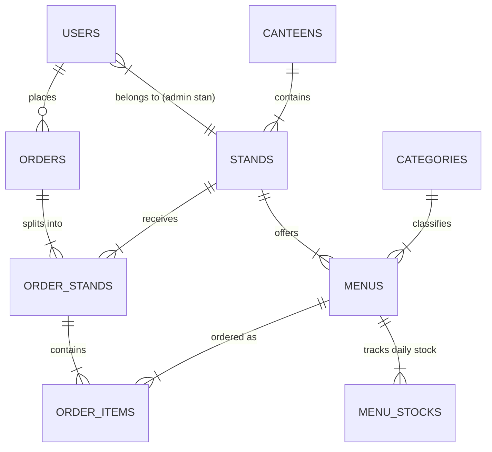
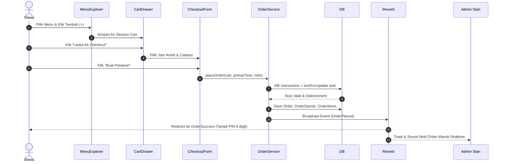
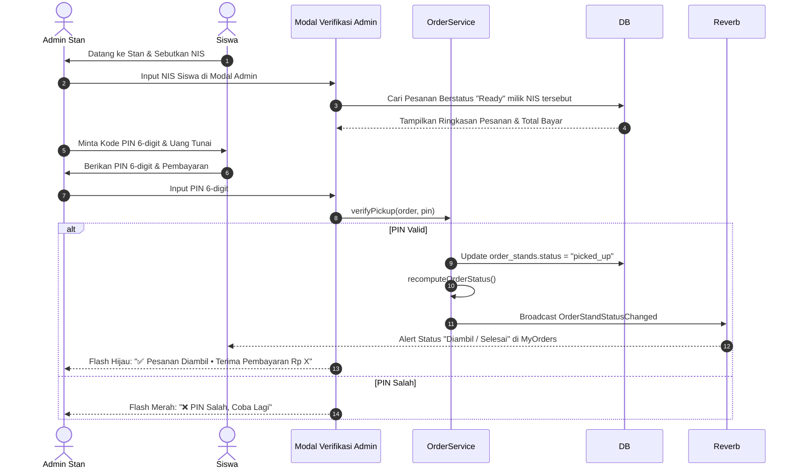

# PRODUCT REQUIREMENT DOCUMENT (PRD)
## KANTIN WIKRAMA — Sistem Pemesanan & Manajemen Kantin Lintas-Stan Realtime

---

## 1. Ringkasan Eksekutif & Latar Belakang

### 1.1 Visi Proyek
**Kantin Wikrama** adalah platform aplikasi web pemesanan makanan dan minuman terintegrasi untuk lingkungan sekolah SMK Wikrama. Aplikasi ini dirancang untuk mengatasi masalah antrean panjang pada jam istirahat, mengoptimalkan pengelolaan stok harian pada setiap stan, serta menyediakan pengalaman pemesanan lintas-stan (*multi-stand ordering*) yang efisien dengan notifikasi *realtime* dan sistem verifikasi pengambilan aman berbasis NIS dan KODE PIN 6-digit.

### 1.2 Tujuan Utama & Metrik Keberhasilan
- **Efisiensi Pengambilan**: Mengurangi waktu tunggu antrean di stan kantin hingga 70%.
- **Transparansi Stok & Pesanan**: Mencegah pemesanan barang habis melalui manajemen kuota stok harian terotomatisasi secara *realtime*.
- **Pemesanan Lintas-Stan (Multi-Stand)**: Siswa dapat memesan menu dari beberapa stan berbeda dalam satu kali checkout.
- **Verifikasi Terpercaya**: Menggunakan verifikasi kombinasi NIS siswa dan KODE PIN 6-digit sekali tampil (*one-time display*) saat pengambilan pesanan.

### 1.3 Pengguna & Peran Sistem
1. **Siswa (Customer)**: Jelajah menu, filter stan/kantin, kelola keranjang lintas-stan, checkout dengan slot waktu ambil, menerima PIN 6-digit, dan melacak status pesanan secara *realtime*.
2. **Admin Stan (Stand Keeper)**: Memproses pesanan masuk khusus stan miliknya, memperbarui status pesanan (*processing* $\rightarrow$ *ready*), melakukan verifikasi pengambilan NIS + PIN, serta mengelola menu dan stok harian.
3. **Super Admin**: Akses penuh ke seluruh stan, manajemen kantin, manajemen stan, manajemen kategori menu, serta analitik laporan pendapatan dan penjualan harian/bulanan.

---

## 2. Arsitektur Sistem & Teknologi

### 2.1 Stack Teknologi Inti
- **Local Server Environment**: Laragon (Apache/Nginx, PHP 8.2+, MySQL/MariaDB, Auto Virtual Host `kantin-wikrama.test`)
- **Backend Framework**: Laravel 11 / 12 (PHP 8.2+)
- **Frontend Framework**: Livewire 3 (Reaktif tanpa full page refresh)
- **Styling & Design System**: Tailwind CSS v4 (Desain responsif, tema Hijau Wikrama)
- **Realtime Engine**: Laravel Reverb (WebSockets bawaan Laravel) + Laravel Echo Client
- **Database Engine**: MySQL 8.0+ / MariaDB (dikelola via Laragon Services & HeidiSQL/Database Manager)
- **Authentication**: Laravel Breeze (Disesuaikan dengan identifikasi NIS unik siswa)

### 2.2 Arsitektur Notifikasi Realtime (Laravel Reverb)
Aplikasi memanfaatkan WebSocket untuk pembaruan status dan notifikasi instan tanpa polling.

```mermaid
graph TD
    Siswa[Siswa / Client] -->|1. Checkout Order| WebServer[Laravel App Server]
    WebServer -->|2. Transaction DB| DB[(Database)]
    WebServer -->|3. Dispatch Event| EventDispatcher[OrderPlaced Event]
    EventDispatcher -->|4. Broadcast via WebSockets| ReverbServer[Laravel Reverb Engine]
    ReverbServer -->|5. Push Notif| AdminDashboard[PrivateChannel: stand.{id}]
    ReverbServer -->|6. Push Notif| SuperAdmin[PrivateChannel: admin.all]

    AdminDashboard -->|7. Update Status to Ready| WebServer
    WebServer -->|8. Dispatch StatusEvent| ReverbServer
    ReverbServer -->|9. Live Refresh UI| SiswaOrders[PrivateChannel: user.{id}]
```

#### Pemetaan WebSocket Channels:
- `PrivateStand.{stand_id}`: Digunakan oleh Admin Stan untuk menerima order masuk khusus stan terkait. (Otentikasi: `user.stand_id == channel_id` atau `is_admin = true`).
- `PrivateAdminAll`: Digunakan oleh Super Admin untuk memantau seluruh transaksi kantin sekolah.
- `PrivateUser.{user_id}`: Digunakan oleh Siswa untuk menerima notifikasi perubahan status pesanan (*processing*, *ready*, *picked_up*) secara *realtime*.

---

## 3. Struktur Direktori Proyek

```
kantin-wikrama/
├─ app/
│  ├─ Enums/
│  │  ├─ OrderStatus.php             # pending, complete, cancelled
│  │  └─ OrderStandStatus.php        # pending, processing, ready, picked_up, cancelled
│  ├─ Events/
│  │  ├─ OrderPlaced.php             # Broadcast saat order baru berhasil dibuat
│  │  └─ OrderStandStatusChanged.php # Broadcast saat status sub-pesanan stan berubah
│  ├─ Livewire/
│  │  ├─ Customer/
│  │  │  ├─ MenuExplorer.php         # Landing page + filter kategori/kantin + pencarian
│  │  │  ├─ CartDrawer.php           # Sliding drawer keranjang lintas-stan
│  │  │  ├─ CartCountBadge.php       # Indikator jumlah barang di navbar
│  │  │  ├─ CheckoutForm.php         # Form milih jam ambil, catatan & validasi stok
│  │  │  ├─ OrderSuccess.php         # Tampilan PIN 6-digit (HANYA tampil 1x)
│  │  │  └─ MyOrders.php             # Daftar pesanan siswa & status realtime Echo
│  │  └─ Admin/
│  │     ├─ Dashboard.php            # Stat card + live order list + bel notifikasi
│  │     ├─ OrderTable.php           # Tabel list pesanan + filter status/stan
│  │     ├─ OrderDetail.php          # Detail order & verifikasi NIS + PIN
│  │     ├─ VerifyPickup.php         # Modal popup verifikasi pengambilan
│  │     ├─ MenuManager.php          # CRUD Menu + upload gambar & toggle ketersediaan
│  │     ├─ CategoryManager.php      # CRUD Kategori Menu
│  │     ├─ StandManager.php         # CRUD Stan & Kantin
│  │     ├─ StockManager.php         # Kelola kuota harian menu
│  │     └─ ReportDashboard.php      # Analitik penjualan & omzet
│  ├─ Models/                        # User, Canteen, Stand, Category, Menu, MenuStock, Order, OrderStand, OrderItem
│  ├─ Services/
│  │  └─ OrderService.php           # Logika inti transaksi, stok atomik, PIN & splitting order
│  ├─ Observers/
│  │  └─ OrderStandObserver.php      # Auto-recompute Order status utama
│  └─ Http/
│     ├─ Controllers/Admin/         # Controller Blade tipis penampung layout admin
│     └─ Middleware/EnsureAdmin.php  # Guard otorisasi area admin
├─ database/
│  ├─ migrations/                   # 11 file migrasi database
│  └─ seeders/DatabaseSeeder.php    # Seeder sampel data kantin, stan, menu & user
├─ resources/views/
│  ├─ layouts/app.blade.php         # Base Layout (Customer & Admin)
│  ├─ livewire/customer/            # Blade template komponen Livewire Customer
│  ├─ livewire/admin/               # Blade template komponen Livewire Admin
│  └─ admin/layouts/sidebar.blade.php
├─ routes/
│  ├─ web.php                       # Route publik & siswa
│  ├─ admin.php                     # Route khusus admin (/admin)
│  └─ channels.php                  # Otorisasi channel private Laravel Reverb
├─ storage/app/public/menus/        # Direktori simpan gambar menu
└─ prd.md                           # Product Requirement Document
```

---

## 4. Spesifikasi Database & Model Data

### 4.1 Diagram Hubungan Entitas (ERD)



### 4.2 Skema Tabel Database

#### 1. `users` (Modifikasi Default Laravel Breeze)
| Kolom | Tipe Data | Attributes / Constraints | Keterangan |
| :--- | :--- | :--- | :--- |
| `id` | `bigint` | Primary Key, Auto Increment | ID Pengguna |
| `name` | `varchar(255)` | Not Null | Nama Lengkap |
| `email` | `varchar(255)` | Unique, Not Null | Email Akun |
| `nis` | `varchar(20)` | Unique, Nullable | Nomor Induk Siswa (Wajib bagi Siswa) |
| `password` | `varchar(255)` | Not Null | Password Hashed |
| `is_admin` | `boolean` | Default: `false` | Flag Hak Akses Admin |
| `stand_id` | `foreignId` | Nullable, FK `stands(id)` | FK Stan jika peran Admin Stan |
| `created_at / updated_at` | `timestamp` | Nullable | Timestamps Standard |

#### 2. `canteens`
| Kolom | Tipe Data | Attributes / Constraints | Keterangan |
| :--- | :--- | :--- | :--- |
| `id` | `bigint` | Primary Key, Auto Increment | ID Kantin (Lokasi Gedung) |
| `name` | `varchar(255)` | Not Null | Nama Kantin (cth: Kantin Utama) |
| `slug` | `varchar(255)` | Unique, Not Null | URL Slug |
| `description` | `text` | Nullable | Deskripsi Kantin |
| `image` | `varchar(255)` | Nullable | Path foto kantin |
| `sort_order` | `integer` | Default: `0` | Urutan Tampil |
| `created_at / updated_at` | `timestamp` | Nullable | Timestamps Standard |

#### 3. `stands`
| Kolom | Tipe Data | Attributes / Constraints | Keterangan |
| :--- | :--- | :--- | :--- |
| `id` | `bigint` | Primary Key, Auto Increment | ID Stan Penjual |
| `canteen_id` | `foreignId` | FK `canteens(id)` ON DELETE CASCADE | ID Kantin Induk |
| `name` | `varchar(255)` | Not Null | Nama Stan (cth: Stan Es-Esan) |
| `description` | `text` | Nullable | Deskripsi Stan |
| `image` | `varchar(255)` | Nullable | Path logo/foto stan |
| `sort_order` | `integer` | Default: `0` | Urutan Tampil |
| `created_at / updated_at` | `timestamp` | Nullable | Timestamps Standard |

#### 4. `categories`
| Kolom | Tipe Data | Attributes / Constraints | Keterangan |
| :--- | :--- | :--- | :--- |
| `id` | `bigint` | Primary Key, Auto Increment | ID Kategori Menu |
| `name` | `varchar(255)` | Not Null | Nama Kategori (Makanan Berat, Minuman, dll) |
| `sort_order` | `integer` | Default: `0` | Urutan Tampil |
| `created_at / updated_at` | `timestamp` | Nullable | Timestamps Standard |

#### 5. `menus`
| Kolom | Tipe Data | Attributes / Constraints | Keterangan |
| :--- | :--- | :--- | :--- |
| `id` | `bigint` | Primary Key, Auto Increment | ID Menu Makanan/Minuman |
| `stand_id` | `foreignId` | FK `stands(id)` ON DELETE CASCADE | ID Stan Pemilik |
| `category_id` | `foreignId` | FK `categories(id)` ON DELETE CASCADE | ID Kategori |
| `name` | `varchar(255)` | Not Null | Nama Menu |
| `description` | `text` | Nullable | Deskripsi Rincian Menu |
| `price` | `decimal(10,2)` | Not Null | Harga Satuan (Rp) |
| `image` | `varchar(255)` | Nullable | Path Foto Menu (`storage/app/public/menus`) |
| `daily_quota` | `integer` | Default: `0` | Kuota Default Harian (`0` = Unlimited) |
| `estimated_minutes` | `integer` | Default: `10` | Estimasi waktu penyiapan (menit) |
| `is_available` | `boolean` | Default: `true` | Status aktif/tampil di katalog |
| `created_at / updated_at` | `timestamp` | Nullable | Timestamps Standard |

#### 6. `menu_stocks`
| Kolom | Tipe Data | Attributes / Constraints | Keterangan |
| :--- | :--- | :--- | :--- |
| `id` | `bigint` | Primary Key, Auto Increment | ID Rekam Stok Harian |
| `menu_id` | `foreignId` | FK `menus(id)` ON DELETE CASCADE | ID Menu |
| `stock_date` | `date` | Not Null | Tanggal Stok |
| `remaining_qty` | `integer` | Not Null | Sisa kuota hari tersebut |
| `created_at / updated_at` | `timestamp` | Nullable | Timestamps Standard |
| *Constraint* | `UNIQUE` | `(menu_id, stock_date)` | Mencegah duplikasi tanggal stok per menu |

#### 7. `orders` (Header Pesanan Utama)
| Kolom | Tipe Data | Attributes / Constraints | Keterangan |
| :--- | :--- | :--- | :--- |
| `id` | `bigint` | Primary Key, Auto Increment | ID Master Order |
| `user_id` | `foreignId` | FK `users(id)` | ID Siswa Pemesan |
| `order_number` | `varchar(255)` | Unique, Not Null | Nomor Order Format: `ORD-YYMMDD-XXXX` |
| `total_price` | `decimal(10,2)` | Not Null | Total Keseluruhan (Rp) |
| `pickup_time` | `datetime` | Not Null | Waktu Rencana Pengambilan |
| `note` | `text` | Nullable | Catatan Tambahan Siswa |
| `pin` | `char(6)` | Not Null | Kode PIN 6-Digit Verifikasi |
| `status` | `enum` | `'pending'`, `'complete'`, `'cancelled'` | Status Keseluruhan Order |
| `created_at / updated_at` | `timestamp` | Nullable | Timestamps Standard |

#### 8. `order_stands` (Sub-Pesanan Per Stan)
| Kolom | Tipe Data | Attributes / Constraints | Keterangan |
| :--- | :--- | :--- | :--- |
| `id` | `bigint` | Primary Key, Auto Increment | ID Sub-Pesanan Stan |
| `order_id` | `foreignId` | FK `orders(id)` ON DELETE CASCADE | FK Master Order |
| `stand_id` | `foreignId` | FK `stands(id)` | FK Stan Pemroses |
| `status` | `enum` | `'pending'`, `'processing'`, `'ready'`, `'picked_up'`, `'cancelled'` | Status Penyiapan di Stan |
| `ready_time` | `datetime` | Nullable | Estimasi Waktu Pesanan Siap |
| `created_at / updated_at` | `timestamp` | Nullable | Timestamps Standard |

#### 9. `order_items` (Rincian Item Menu)
| Kolom | Tipe Data | Attributes / Constraints | Keterangan |
| :--- | :--- | :--- | :--- |
| `id` | `bigint` | Primary Key, Auto Increment | ID Item Pesanan |
| `order_stand_id` | `foreignId` | FK `order_stands(id)` ON DELETE CASCADE | FK Sub-Pesanan Stan |
| `menu_id` | `foreignId` | FK `menus(id)` | FK Menu |
| `quantity` | `integer` | Not Null, `> 0` | Jumlah Porsi Dipesan |
| `price` | `decimal(10,2)` | Not Null | Harga Satuan Saat Transaksi (Snapshot) |
| `created_at / updated_at` | `timestamp` | Nullable | Timestamps Standard |

---

## 5. Arsitektur Logika Bisnis & Service Inti

Seluruh transaksi pemesanan dipusatkan pada `App\Services\OrderService.php` guna menjamin integritas data, atomisitas stok, dan konsistensi status.

### 5.1 Fungsi Utama `OrderService.php`

#### `placeOrder(User $user, array $cartItems, string $pickupTime, ?string $note): Order`
Menjalankan transaksi database (`DB::transaction`) dengan langkah:
1. **Validasi Stok Atomik (`validateAllStocks`)**: Memeriksa `remaining_qty` pada tabel `menu_stocks` untuk tanggal `pickupTime`. Memakai query `lockForUpdate()` untuk mencegah *race condition*.
2. **Pengurangan Stok (`reserveStocks`)**: Mengurangi kuota `remaining_qty` secara langsung sesuai jumlah pesanan.
3. **Generasi PIN Unik 6-Digit (`generatePin`)**: Membuat 6 digit acak `rand(100000, 999999)` dan memastikan PIN belum aktif pada order bertanggal sama.
4. **Generasi Nomor Order (`createOrderNumber`)**: Membuat kode urut harian unik dengan format `ORD-YYMMDD-XXXX`.
5. **Pemisahan Pesanan Lintas Stan (`splitByStand`)**: Pengelompokan barang belanjaan berdasarkan `stand_id`. Membuat 1 rekam `orders`, $N$ rekam `order_stands`, dan rekam `order_items` sesuai item.
6. **Broadcasting Event (`OrderPlaced`)**: Memicu event Laravel Reverb ke channel WebSocket masing-masing stan.

#### `verifyPickup(Order $order, string $pin): bool`
1. Memvalidasi kecocokan PIN yang diinput Admin Stan dengan PIN pada header `orders`.
2. Jika cocok, mengubah `order_stands.status` khusus stan tersebut menjadi `'picked_up'`.
3. Memanggil `recomputeOrderStatus($order)` untuk mengevaluasi apakah seluruh stan telah menyerahkan pesanan.

#### `cancelOrder(Order $order): bool`
1. Pembatalan hanya diizinkan jika seluruh `order_stands` masih berstatus `'pending'`.
2. Mengembalikan sisa stok ke `menu_stocks` jika tanggal pesanan adalah hari ini.

#### `computeReadyTime(OrderStand $orderStand): Carbon`
Menghitung perkiraan waktu siap: `Carbon::now() + max(menu.estimated_minutes)` dari seluruh item dalam sub-pesanan tersebut.

#### `recomputeOrderStatus(Order $order): void`
- Jika **seluruh** `order_stands` berstatus `'picked_up'`, maka `orders.status` diubah menjadi `'complete'`.
- Jika **ada** sub-pesanan yang dibatalkan dan sisa sub-pesanan juga dibatalkan, `orders.status` menjadi `'cancelled'`.

---

## 6. Alur Kerja Utama Sistem (User Workflows)

### 6.1 Workflow Pemesanan Lintas-Stan (Siswa)



### 6.2 Workflow Verifikasi Pengambilan Pesanan (Admin Stan)



---

## 7. Spesifikasi Fitur per Modul

### 7.1 Modul Customer (Siswa)

#### A. Landing Page & Katalog Menu (`MenuExplorer.php`)
- **Header Hijau Wikrama**: Hero banner dengan nama Kantin Wikrama, bar pencarian cepat, chip filter kategori (*Makanan Berat, Jajanan, Minuman, Camilan*), dan dropdown filter lokasi kantin (*Kantin Utama, Kantin Hotel, Kantin IDS, Kantin BDP*).
- **Grid Menu**: Tampilan 2 kolom (mobile) dan 4 kolom (desktop).
- **Kartu Menu**: Foto produk (aspect 4/3), nama menu, nama Stan & Kantin, harga dalam format Rupiah, badge ketersediaan stok (*Overlay HABIS* / *Badge Sisa X* / *Unlimited*), serta tombol bundar `+` warna Amber.
- **Interaksi**: Klik `+` memicu aksi Livewire tanpa refresh halaman, menambah badge keranjang di navbar, dan memunculkan notifikasi toast.

#### B. Sliding Cart Drawer (`CartDrawer.php`)
- Slidedrawer dari kanan layar (overlay full-screen pada mobile).
- **Elemen Item**: Miniatur gambar menu, nama menu, harga, kuantitas stepper (`−` dan `+`), subtotal, serta tombol hapus (`×`).
- **Grouping**: Item dikelompokkan secara visual berdasarkan nama Stan penjual.
- **Footer**: Menampilkan Total Harga Keseluruhan dan tombol utama "Lanjut ke Checkout".

#### C. Form Checkout (`CheckoutForm.php`)
- **Pilihan Waktu Ambil**: Seleksi tanggal (Hari Ini / Besok) & Slot Jam Ambil (08:00 – 14:00 dengan rentang per 15 menit).
- **Catatan**: Textarea opsional untuk instruksi khusus (cth: "Jangan pakai cabai").
- **Ringkasan Transaksi**: Breakdown harga per stan beserta total bayar tunai di kantin.
- **Validasi Gagal**: Jika stok mendadak habis sebelum checkout, sistem menampilkan pesan error spesifik per item yang kekurangan stok.

#### D. Halaman Sukses & Tampilan PIN (`OrderSuccess.php`)
- **Tampilan PIN Kritis**: Teks peringatan merah tebal *"Catat / Ingat Kode PIN Ini Untuk Pengambilan Pesanan!"*.
- **Display PIN**: Kartu PIN 6-digit ukuran ekstra besar dengan efek *tracking-widest*.
- **Aturan Keamanan**: KODE PIN **HANYA DITAMPILKAN SATU KALI** setelah checkout berhasil (`pin_shown_at`). PIN tidak akan ditampilkan lagi pada halaman pesanan saya demi alasan keamanan.
- **Detail Rincian Ambil**: Menampilkan lokasi stan tempat mengambil pesanan, jam ambil, dan nominal uang pas yang harus disiapkan.

#### E. Pesanan Saya (`MyOrders.php`)
- **Daftar Pesanan Active & History**: Menampilkan kartu pesanan dengan nomor order (`ORD-YYMMDD-XXXX`), tanggal/jam ambil, total harga, dan rincian per stan.
- **Status Realtime**: Terhubung ke Laravel Reverb via Channel `PrivateUser.{user_id}`. Badge status akan berubah secara otomatis (*Pending* $\rightarrow$ *Diproses* $\rightarrow$ *Siap Diambil* $\rightarrow$ *Selesai*) disertai estimasi jam siap tanpa perlu mereload browser.

---

### 7.2 Modul Admin & Penjaga Stan

#### A. Admin Dashboard (`AdminDashboard.php`)
- **Topbar**: Judul sistem, bel notifikasi realtime (dengan suara *chime* & *counter bubble* ketika pesanan baru masuk), serta profile dropdown.
- **Stat Cards (4 Ringkasan)**: Total Pesanan Hari Ini, Pesanan Menunggu Diproses, Total Pendapatan Hari Ini (Cash), dan Total Porsi Terjual.
- **Tabel Pesanan Masuk Live**: Menampilkan pesanan terbaru secara realtime dengan kolom Nomor Order, NIS & Nama Siswa, Total Bayar, Rincian Per Stan, Status Penyiapan, dan Action Cepat (*Proses / Siap / Verifikasi*).

#### B. Pengelolaan Pesanan & Verifikasi (`OrderTable.php` & `VerifyPickup.php`)
- **Filter Khusus Admin Stan**: Admin stan hanya dapat melihat dan mengolah pesanan yang mengandung item dari stan miliknya. Super Admin dapat memfilter seluruh stan.
- **Perubahan Status Penyiapan**: Tombol toggle instan untuk merubah status dari *Pending* $\rightarrow$ *Processing* $\rightarrow$ *Ready*.
- **Modal Verifikasi Ambil (NIS + PIN)**:
  - Step 1: Input NIS Siswa $\rightarrow$ Sistem mencari pesanan berstatus *Ready* milik siswa tersebut.
  - Step 2: Konfirmasi PIN 6-Digit yang diucapkan siswa $\rightarrow$ Sistem memvalidasi dan mengubah status menjadi *Picked Up* serta mengonfirmasi jumlah uang tunai yang wajib diterima.

#### C. Manajemen Menu & Stok (`MenuManager.php` & `StockManager.php`)
- **CRUD Menu**: Modal form interaktif untuk menambah/mengedit nama, kategori, stan, harga, deskripsi, estimasi penyiapan (menit), kuota harian, serta upload foto produk ke `storage/app/public/menus`.
- **Quick Switch**: Toggle switch cepat untuk mengaktifkan/menonaktifkan status `is_available` menu.
- **Pengaturan Kuota Harian**: Mengatur sisa kuota harian menu untuk tanggal berjalan. Kuota `0` mengindikasikan ketersediaan *Unlimited* (seperti produk minuman saset/air mineral).

#### D. Dashboard Laporan & Analitik (`ReportDashboard.php`)
- **Ringkasan Pendapatan**: Total omzet harian, mingguan, dan bulanan dari transaksi yang berstatus *Complete*.
- **Visualisasi Penjualan 7 Hari**: Grafik batang tren pendapatan harian menggunakan Tailwind CSS Bar Chart.
- **Top 5 Menu Terlaris**: Daftar menu paling banyak dipesan beserta jumlah porsi terjual.
- **Analisis Jam Sibuk**: Breakdown statistik waktu pengambilan pesanan untuk memetakan jam padat kantin.

---

## 8. Peta Rute & Matrix Hak Akses

### 8.1 Public & Customer Routes (`routes/web.php`)
| HTTP Method | URI | Action / Livewire Component | Description / Guard |
| :--- | :--- | :--- | :--- |
| `GET` | `/` | `Customer\MenuExplorer` | Landing Page & Katalog Utama |
| `GET` | `/register` | Breeze Register Controller | Registrasi Akun Siswa (Wajib NIS) |
| `GET` | `/login` | Breeze Login Controller | Login Siswa & Admin |
| `GET` | `/menu` | `Customer\MenuExplorer` | Filter Katalog via Query Parameter |
| `POST` | `/checkout` | `Customer\CheckoutForm` | Eksekusi Pemesanan & DB Transaction |
| `GET` | `/order/{id}/sukses` | `Customer\OrderSuccess` | Halaman PIN 6-Digit (Guard: Owner & 1x Tampil) |
| `GET` | `/pesanan` | `Customer\MyOrders` | Daftar Pesanan Siswa (Auth Guard) |
| `GET` | `/pesanan/{id}` | `Customer\MyOrders` | Detail Pesanan Siswa (Auth Guard) |

### 8.2 Admin Routes (`routes/admin.php`)
> **Middleware**: `auth`, `EnsureAdmin` (`is_admin == true`)

| HTTP Method | URI | Action / Livewire Component | Scope Access |
| :--- | :--- | :--- | :--- |
| `GET` | `/admin` | `Admin\Dashboard` | Admin Stan & Super Admin |
| `GET` | `/admin/orders` | `Admin\OrderTable` | Filtered by `user.stand_id` |
| `GET` | `/admin/orders/{id}` | `Admin\OrderDetail` | Detail Order & Verifikasi |
| `POST` | `/admin/orders/{id}/verifikasi` | `OrderService::verifyPickup` | Verifikasi NIS + PIN |
| `PATCH` | `/admin/order-stands/{id}/status` | `OrderStand::updateStatus` | Ubah status ke Processing / Ready |
| `GET/POST/PUT` | `/admin/menus` | `Admin\MenuManager` | CRUD Menu & Upload Foto |
| `GET/POST` | `/admin/categories` | `Admin\CategoryManager` | CRUD Kategori Menu |
| `GET/POST` | `/admin/stands` | `Admin\StandManager` | CRUD Stan & Kantin (Super Admin) |
| `GET/POST` | `/admin/stocks` | `Admin\StockManager` | Kelola Kuota Stok Harian |
| `GET` | `/admin/reports` | `Admin\ReportDashboard` | Analitik Omzet & Laporan |

---

## 9. Design System & Spesifikasi UI/UX

### 9.1 Konsep Visual & Aset Desain
Desain UI/UX **Kantin Wikrama** mengusung konsep **"Fresh, Modern & Effortless School Canteen"** dengan pendekatan *Mobile-First*. Antarmuka dirancang untuk memberikan impresi visual yang bersih, modern, dan sangat intuitif, mengombinasikan warna khas identitas SMK Wikrama dengan elemen *Glassmorphism* dan *Micro-animations*.

### 9.2 Token Warna Solid (Flat Modern Design Tokens)
- **Primary Emerald (Wikrama Green)**:
  - Base: `#16a34a` (`emerald-600`) — Warna solid untuk tombol aksi utama, navbar & header hero.
  - Deep Emerald: `#064e3b` (`emerald-900`) — Teks judul & background footer.
  - Light Mint: `#dcfce7` (`emerald-100`) — Background badge status & hover surface.
- **Accent Warm Amber (Interaktif & CTA)**:
  - Base: `#f59e0b` (`amber-500`) — Tombol Tambah (`+`), Badge Keranjang & Notifikasi.
  - Deep Amber: `#d97706` (`amber-600`) — Hover state tombol sekunder (solid color shift).
- **Surface & Background**:
  - Main Background: `#f8fafc` (`slate-50`)
  - Surface Card: `#ffffff` (`white`) dengan border `#f1f5f9` (`slate-100`)
  - Overlay Panel: `bg-white/95 backdrop-blur-sm border border-slate-100 shadow-md` (Lebih solid, minimalis)
- **Indikator Status Pesanan (Semantic Palette)**:
  - *Pending*: `bg-amber-50 text-amber-700 border-amber-200` (Kuning)
  - *Processing*: `bg-blue-50 text-blue-700 border-blue-200` (Biru)
  - *Ready*: `bg-emerald-50 text-emerald-700 border-emerald-200` (Hijau Terang Solid)
  - *Picked Up / Complete*: `bg-slate-100 text-slate-700 border-slate-200` (Abu-abu)
  - *Cancelled*: `bg-rose-50 text-rose-700 border-rose-200` (Merah)

### 9.3 Sistem Tipografi
- **Primary Font (UI & Body)**: `Plus Jakarta Sans` / `Inter` (Google Fonts) — Digunakan untuk seluruh teks antarmuka, judul, dan navigasi.
- **Monospace Font (PIN & Nomor Order)**: `JetBrains Mono` / `Fira Code` — Digunakan khusus untuk Kode PIN 6-Digit (`tracking-[0.3em] font-bold text-3xl`) dan Nomor Order (`ORD-YYMMDD-XXXX`) agar mudah dibaca oleh admin stan.

### 9.4 Blueprint Komponen UI Utama

#### A. Header Hero & Bar Filter Sticky (Landing Page)
- **Hero Banner**: Background hijau solid (`bg-emerald-600`) yang bersih dan minimalis dengan salam personal *"Selamat Pagi, [Nama Siswa]! Mau jajan apa hari ini?"*.
- **Search & Filter Bar**:
  - Input pencarian bergaya flat modern dengan ikon kaca pembesar & fokus border hijau solid.
  - Chip filter horizontal kategori (*Semua, Makanan Berat, Jajanan, Minuman, Camilan*) dengan scroll halus tanpa scrollbar (`overflow-x-auto scrollbar-none`).
  - Dropdown pemilih kantin (*Semua Kantin, Kantin Utama, Kantin Hotel, Kantin IDS, Kantin BDP*).

#### B. Kartu Menu Interaktif (Menu Card Component)
- **Layout Card**: `rounded-3xl border border-slate-100 bg-white p-3 shadow-sm hover:shadow-xl hover:-translate-y-1 transition-all duration-300 flex flex-col justify-between`.
- **Media**: Foto produk dengan aspect ratio `4:3`, `rounded-2xl object-cover overflow-hidden`.
- **Badge Overlay**:
  - *Stok Habis*: Overlay gelap `bg-black/60 backdrop-blur-sm` dengan teks terpusat `"STOK HABIS"`.
  - *Sisa Kuota*: Pill badge di sudut kanan atas `bg-emerald-500/90 text-white font-semibold text-xs px-2.5 py-1 rounded-full shadow-md`.
- **Informasi Produk**: Judul menu tebal, nama stan & kantin dengan ikon mini lokasi, harga dalam format Rupiah (`Rp 8.000`).
- **Tombol Action `+`**: Tombol lingkaran Amber `w-10 h-10 rounded-full bg-amber-500 hover:bg-amber-600 text-white flex items-center justify-center shadow-lg hover:scale-110 active:scale-95 transition-all duration-200`.

#### C. Keranjang Sliding Drawer (Cart Drawer Component)
- **Overlay Slidedrawer**: Transisi geser mulus dari kanan layar dengan backdrop `bg-slate-900/40 backdrop-blur-sm`.
- **Pengelompokan Item**: Item belanjaan dipisahkan berdasarkan blok nama Stan untuk kejelasan visual.
- **Stepper Kuantitas**: Tombol `-` dan `+` dengan counter angka di tengah, disertai tombol hapus `×` merah di sudut kanan.
- **Footer Sticky Checkout**: Total bayar besar dengan tombol CTA Amber *"Lanjut ke Checkout ➔"*.

#### D. Kartu PIN & Halaman Pengambilan (Order Success PIN Component)
- **Hero Banner Sukses**: Kartu sukses berlatar hijau emerald dengan ilustrasi ceklis animasi (`animate-bounce`).
- **Tampilan Kode PIN 6-Digit**:
  - Frame kotak PIN dengan `bg-slate-900 text-emerald-400 p-6 rounded-3xl shadow-2xl border-2 border-emerald-500/30 text-center`.
  - Digit PIN ditampilkan berukuran ekstra besar (`text-4xl sm:text-5xl font-mono tracking-[0.4em] font-black font-extrabold`).
  - Label peringatan keamanan bertinta merah tebal: *"📸 Catat/Ingat Kode PIN Ini! PIN hanya ditampilkan sekali ini demi keamanan."*

#### E. Timeline Progress Pesanan (Status Stepper Component)
- Stepper 4 tahap visual di halaman `MyOrders`: `Pending ➔ Diproses ➔ Siap Diambil ➔ Selesai`.
- Garis progress menyala hijau (`bg-emerald-500`) secara otomatis saat event WebSocket Reverb diterima dari admin stan.

#### F. Dashboard Admin & Modal Verifikasi PIN
- **Stat Cards**: Card metrik modern dengan ikon berwarna, angka ukuran besar, dan statistik persentase harian.
- **Realtime Order Card (Live Feed)**: Pesanan baru masuk ditandai dengan efek ping hijau menyala (`animate-ping bg-emerald-400`) serta suara bel notifikasi soft chime.
- **Modal Input PIN Verifikasi**: Input box 6-digit terpisah dengan auto-focus, memberikan animasi *shake* merah jika PIN salah dan efek *confetti/glowing green flash* ketika PIN valid.

### 9.5 Mikro-Animasi & Efek Interaktif
- **Floating Cart Count Pulse**: Badge angka keranjang di navbar berkedip/membuat efek *bounce* kecil setiap kali menu baru ditambahkan.
- **Toast Notification Slide-In**: Toast melayang di sudut atas layar dengan transisi *slide-down* menceritakan item berhasil ditambahkan.
- **Smooth Page Transitions**: Pergantian filter kategori dan penambahan item keranjang diproses tanpa *full page reload* memanfaatkan reaktivitas Livewire 3.

---

## 10. Keamanan, Validasi & Aturan Bisnis

1. **Aturan Peran (Role Scoping)**:
   - Pengguna dengan `is_admin = 0` dilarang mengakses seluruh rute `/admin`.
   - Admin Stan (`stand_id != null`) hanya diizinkan melihat, menerima notifikasi, dan merubah status pesanan yang memiliki item dari `stand_id` miliknya.
2. **Integritas Stok & Transaksi Atomik**:
   - Seluruh mutasi kuota stok wajib dibungkus dalam `DB::transaction()` dengan klausa `lockForUpdate()` pada tabel `menu_stocks`.
3. **Keamanan PIN Pengambilan**:
   - KODE PIN 6-digit dibuat acak dan unik per tanggal transaksi.
   - PIN hanya ditampilkan satu kali pada halaman `/order/{id}/sukses`. Flag `pin_shown_at` mencatat waktu tayang untuk mencegah tayang ulang jika URL di-bookmark atau di-share.
4. **Keamanan Upload File**:
   - Foto menu diwajibkan berupa file gambar (`jpg, jpeg, png, webp`) dengan ukuran maksimum 2MB (`max:2048`).
   - Nama file diubah secara otomatis menjadi `menu-{id}-{timestamp}.{ext}` dan disimpan dalam direktori terisolasi `storage/app/public/menus`.

---

## 11. Rencana Pelaksanaan & Verifikasi Phased Build

| Tahap | Deliverable Utama | Metode Verifikasi & Acceptance Criteria |
| :---: | :--- | :--- |
| **1** | Scaffolding Laravel + Breeze + Livewire + Tailwind CSS v4 di Laragon | Konfigurasi Virtual Host Laragon (`http://kantin-wikrama.test`), `php artisan migrate` sukses; server `npm run dev` & Reverb berjalan tanpa error. |
| **2** | Auth Customization (Field NIS & Guard Admin) | Registrasi siswa wajib NIS unik; akses rute `/admin` tanpa hak akses ter-redirect dengan flash error. |
| **3** | Migrasi Database (11 Tabel) & Model Relationships | Pengujian relasi via `php artisan tinker` (cth: `$canteen->stands`, `$order->orderStands`). |
| **4** | Seeder Kantin, Stan, Kategori, Menu & Akun Demo | Exec `php artisan db:seed`; data terisi lengkap di database dengan 8 stan dan 30 menu. |
| **5** | Landing Page, Katalog Menu & Filter Realtime | Tampilan grid menu rapi; filter kategori & kantin berfungsi instan tanpa reload browser. |
| **6** | Keranjang Drawer, Form Checkout & OrderService | Pengujian pesan barang dari 2 stan berbeda; stok didecrement secara atomik; PIN 6-digit tergenerasi. |
| **7** | Laravel Reverb & Echo WebSocket Configuration | Pengujian 2 jendela browser: Checkout di browser Siswa memicu notifikasi suara & toast otomatis di browser Admin Stan. |
| **8** | Admin Order Dashboard & Modal Verifikasi NIS + PIN | Perubahan status *Pending* $\rightarrow$ *Processing* $\rightarrow$ *Ready*; Verifikasi PIN sukses mengubah status menjadi *Picked Up*. |
| **9** | CRUD Menu, Upload Gambar & Stock Manager | Tambah/Edit menu baru beserta upload foto berhasil tampil di katalog; kuota harian dapat diperbarui. |
| **10** | Laporan Pendapatan & Polish UI Responsive | Halaman laporan menampilkan total omzet & grafik 7 hari; tampilan responsif sempurna di perangkat Mobile & Desktop. |
| **11** | Manual End-to-End Testing & Dokumentasi PRD | Seluruh alur transaksi dari pemesanan lintas-stan hingga penyerahan barang berjalan 100% tanpa celah bug. |

---
*Dokumen PRD ini menjadi acuan tunggal (Single Source of Truth) untuk pengembangan proyek Kantin Wikrama.*